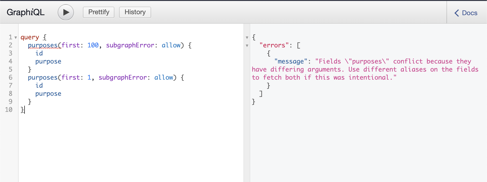
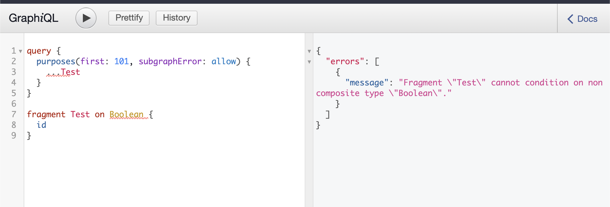

# Abstract

The Graph API layer for consumers is using GraphQL as a protocol to expose data. Graph Node is capable today of parsing and executing GraphQL operations and return spec-compliant results.
The GraphQL specification also includes a validation phase, intended to remove all ambiguities, conflicts, or runtime errors.

# Motivation

This change will ultimately allow us to have a more accurate results from the GraphQL engine, and eliminate all potential issues and conflicts from the GraphQL engine runtime.

In addition, the ability to validate GraphQL operations as a separate phase prior to execution, provides a safe layer to implement custom validation rules, to address security issues, complexity limitations and other custom validation that we might need in the future.

# Prior Art

- [GraphQL (JS/TS) Reference Implementation](https://github.com/graphql/graphql-js/tree/main/src/validation/rules)
- [Juniper (Rust) validations](https://github.com/graphql-rust/juniper/tree/master/juniper/src/validation/rules)

# High Level Description

The GraphQL specification describes the flow of execution with the following phases:

1. `parse` - a phase where the incoming GraphQL operation is being parsed and syntactically validated (using lexer).
2. `validate` - a phase where parsed GraphQL operation is being validated against specific set of rules. Rules are either defined by the GraphQL spec, or by the developer.
3. `execute` - a phase where a valid GraphQL operation is executed and resolved into the actual data properties from the data source.

# Detailed Specification

The following GraphQL validation rules are implemented according to the GraphQL specification:

- `UniqueOperationNames` (https://spec.graphql.org/draft/#sec-Operation-Name-Uniqueness)
- `SingleFieldSubscriptions` (https://spec.graphql.org/draft/#sec-Operation-Name-Uniqueness)
- `KnownTypeNames` (https://spec.graphql.org/draft/#sec-Fragment-Spread-Type-Existence)
- `VariablesAreInputTypes` (https://spec.graphql.org/draft/#sec-Variables-Are-Input-Types)
- `FieldsOnCorrectType` (https://spec.graphql.org/draft/#sec-Field-Selections)
- `LoneAnonymousOperation` (https://spec.graphql.org/draft/#sec-Lone-Anonymous-Operation)
- `FragmentsOnCompositeTypes` (https://spec.graphql.org/draft/#sec-Fragments-On-Composite-Types)
- `OverlappingFieldsCanBeMerged` (https://spec.graphql.org/draft/#sec-Field-Selection-Merging)
- `NoUnusedFragments` (https://spec.graphql.org/draft/#sec-Fragments-Must-Be-Used)
- `KnownFragmentNamesRule` (https://spec.graphql.org/draft/#sec-Fragment-spread-target-defined)
- `LeafFieldSelections` (https://spec.graphql.org/draft/#sec-Leaf-Field-Selections)
- `UniqueFragmentNames` (https://spec.graphql.org/draft/#sec-Fragment-Name-Uniqueness)
- `NoFragmentsCycle` (https://spec.graphql.org/draft/#sec-Fragment-spreads-must-not-form-cycles)
- `PossibleFragmentSpreads` (https://spec.graphql.org/draft/#sec-Fragment-spread-is-possible)
- `NoUnusedVariables` (https://spec.graphql.org/draft/#sec-All-Variables-Used)
- `NoUndefinedVariables` (https://spec.graphql.org/draft/#sec-All-Variable-Uses-Defined)
- `KnownArgumentNames` (https://spec.graphql.org/draft/#sec-Argument-Names , https://spec.graphql.org/draft/#sec-Directives-Are-In-Valid-Locations)
- `UniqueArgumentNames` (https://spec.graphql.org/draft/#sec-Argument-Names)
- `UniqueVariableNames` (https://spec.graphql.org/draft/#sec-Variable-Uniqueness)
- `ProvidedRequiredArguments` (https://spec.graphql.org/draft/#sec-Required-Arguments)
- `ValuesOfCorrectType` (https://spec.graphql.org/draft/#sec-Values-of-Correct-Type)
- `VariablesInAllowedPosition` (https://spec.graphql.org/draft/#sec-All-Variable-Usages-Are-Allowed)
- `KnownDirectives` (https://spec.graphql.org/draft/#sec-Directives-Are-Defined)
- `UniqueDirectivesPerLocation` (https://spec.graphql.org/draft/#sec-Directives-Are-Unique-per-Location)

The following spec rules are not part of this implementation:

- `ExecutableDefinitions` - not needed, because of `graphql_parser` nature.
- `UniqueInputFieldNames` (blocked by https://github.com/graphql-rust/graphql-parser/issues/59, low priority for `graph-node`)

In case of a validation error as part of the `validate` phase, `graph-node` will return a validation error, and will skip the GraphQL execution:

# Backwards Compatibility

The GraphQL execution layer will run in the same way, but due to the nature of the extra added validation checks, some users might experience a change in the way `graph-node` responds to end-users GraphQL operations.

To address the potential breaking change for users, we applied the following measures:

1. Document the change, how it might effect consumers and how to migrate/fix invalid operations (https://github.com/graphprotocol/docs/pull/284)
2. Provide a CLI tool that can locate potential operations that might be invalid at runtime (documented in https://github.com/graphprotocol/docs/pull/284)
3. Find high-traffic and high-profile Subgraphs and contact the owners, in order to give them enough time to fix invalid operations.
4. Run GraphQL validations as part of the Studio GraphiQL editor, to make sure users are aware of this change ahead of time (https://github.com/edgeandnode/graphiql-playground/pull/17).
5. Announce GraphQL validations is coming, and provide enough time for consumers to adjust.

Due to the nature of this change, only end-users and not Subgraph developers are effected. We are not able to find all effected users, but we can give users enough time to adjust and fix their invalid GraphQL operations.

# Dependencies

A single dependency on an external package [`graphql-tools-rs`](https://github.com/dotansimha/graphql-tools-rs) (developed and maintained by The Guild) is required. This package performs and implements the actual GraphQL validation phase. This package also runs all checks and validations, as defined in the GraphQL reference implementation and by the GraphQL specification.

# Risks and Security Considerations

A performance risk is in place, due to the nature of adding a new phase to the GraphQL execution pipeline. It was mitigated by code review by `graph-node` project leads. All changes were tested on standalone environments prior to rollout. In addition, the production environment is running the GraphQL validations phase in silent mode

# Validation

To reduce possible impact on performance, we had the following steps performed:

1. Tested on staging environment.
2. Tested on production environment (in "silent" mode) for over 3 months, to ensure it's not impacting actual runtime.
3. Metrics and logging has been implemented, to ensure we are able to track performance and runtime of the new phase.

# Copyright Waiver

Copyright and related rights waived via [CC0](https://creativecommons.org/publicdomain/zero/1.0/).
